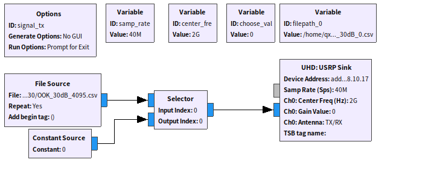
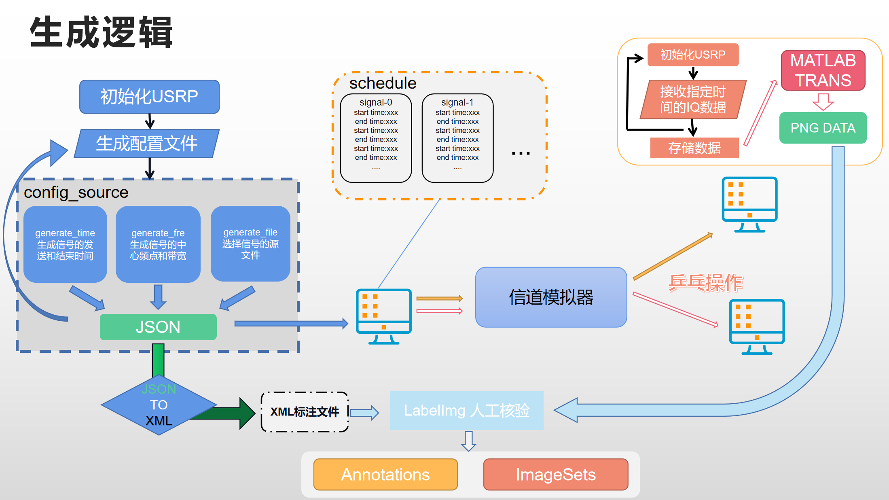
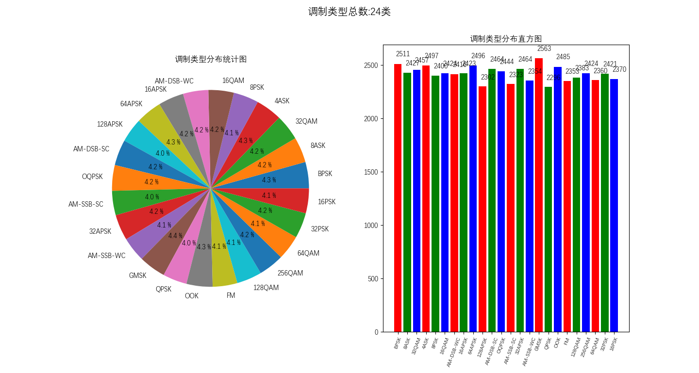
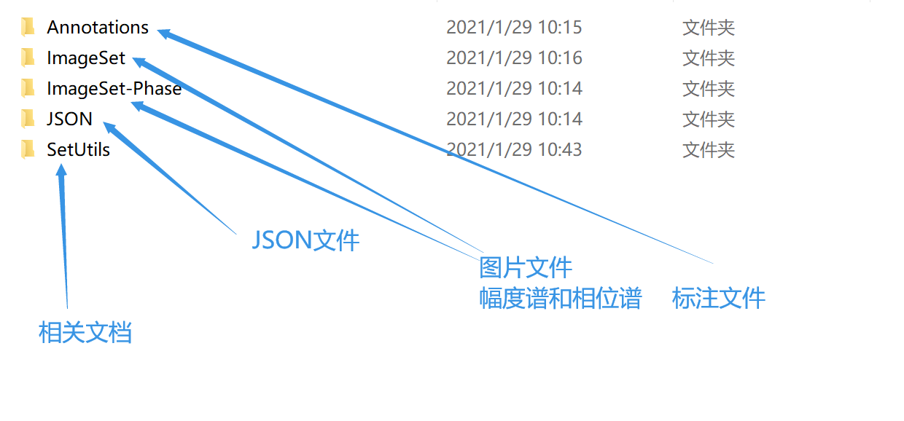
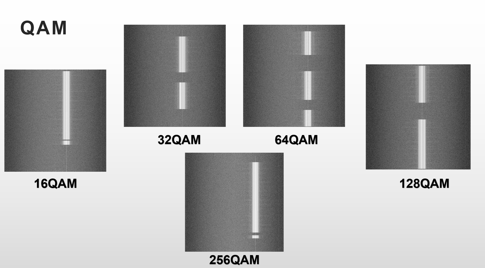

# radio_dataset_generation


## 所需环境

- python 2.7
- gnuradio 3.7.12.0

## 文件目录

```
项目目录
│  README.md
│  
├─RX
│      rx2file.sh        #发射执行shell脚本
│      rx_to_file.py     #接收端USRP
│      
├─TX
│      config_source.py  #生成信号配置文件
│      config_source.pyc
│      generate_file.py  #生成信号的源文件路径
│      generate_file.pyc
│      generate_fre.py   #生成信号的中心频率
│      generate_fre.pyc
│      generate_time.py  #生成信号的作用时间
│      generate_time.pyc
│      shutdown.m        #平台关闭文件
│      signalTX.sh       #发射执行shell脚本
│      usrp_tx_1.py      #单一USRP发射机
│      usrp_tx_2.py      #双USRP发射机
│      usrp_tx_3.py      #三USRP发射机
│      usrp_tx_4.py      #四USRP发射机
│      
└─Utils
    ├─Helper
    │      change_class.py   #改变信号标注
    │      compare.py     
    │      plot_bar_pie.py
    │      plot_utils.py
    │      rename.py
    │      
    ├─JSON2XML
    │      json2xml.py       #将JSON文件转换为XML文件，可以再labelImg中使用
    │      pascal_voc_io.py  #pascal_voc版本XML文件生成包
    │      run.sh            #shell执行脚本
    │      
    └─RAW2PNG
            average_pooling.m        
            average_pooling_angle.m
            mlab.sh          #shell执行脚本
            parse.m          #将RAW文件转为PNG图片文件
```

- TX：发射端

- RX：接收端
- Utils：处理模块


## 使用步骤及细节

1. 在发射机控制电脑上下载TX系列文件，在接收机控制电脑上下载RX文件，同时，这两台电脑需要在同一网段下进行UDP通信，确保两电脑的IP地址和可供使用的端口正确，在usrp_tx_x.py文件中和rx_to_file.py文件中头部修改IP地址和端口号。

2. 修改TX的shell执行脚本中执行的py文件，以及传入的参数，设置USPR的采样率和中心频率，执行的次数，信号的带宽，是否跳频，以及USRP延时

   - 经过测试，当USRP以40M发射时，需要设置0.2秒的延时，而已20M发射时，不需要延时（但要填入0），该操作目的是保证自动化标注的准确性
   - 使用时需要再次测试，一切以实际测试结果为准，经验仅供参考
   - 在跳频时会出现在为设置时刻**乱跳**，谨慎使用，可能需要人工后期校对

3. 在接收端需要设置接收端USRP的采样率和中心频率，该设置与发射端USRP配置相同。

4. 需要根据接收端的存储容量设计发送端的执行次数，一般，以40M采样率接收6.8秒的Raw文件大小为2.2G。

5. 当发射机执行完后，会向接收机发送结束信号后关闭USRP平台，接收机会进入MATLAB处理阶段。

6. JSON文件中保存的格式如下

   ```
   {
       "signal_block_x": [
           {
               "filepath": "/home/qxslab/lcg/dataset_radioml/dataset_all_gnuradio/4ASK/20/4ASK_20dB_4076.csv",
               "modulation": "4ASK",
               "start_time": 0.4026,
               "bandwidth": 2500000.0,
               "end_time": 4.2944,
               "center_fre": 1975408826.0
           }
       ],
       "signal_num": 1  #信号个数
   }
   ```

7. Matlab生成的PNG图片尺寸为(512,512,1)，方便网络输入。

8. Matlab会生成幅度谱和相位谱的时频图，分别保存在`amplitude` 和 `phase`文件夹中，文件命名相同。

9. 使用脚本转换的XML文件可以直接加载在`labelImg`标注软件中进行校对和修改


## 整体逻辑

GNURadio内生成的结构：






## 使用情况

目前，已经使用该脚本生成了，图片集为10224个项目，标注集为10224个项目，相位图集为3908个项目。



> 样例展示

目录：





## 日志

- 创建于2021/1/29-14:13

